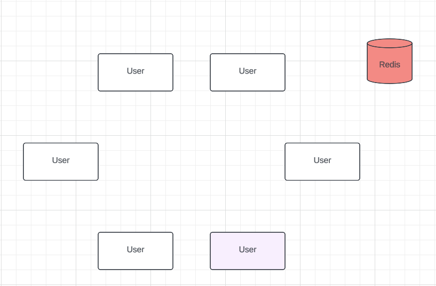
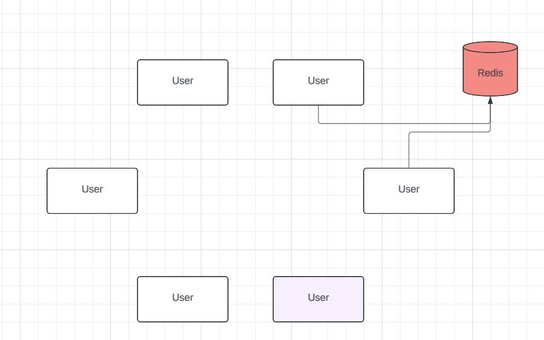
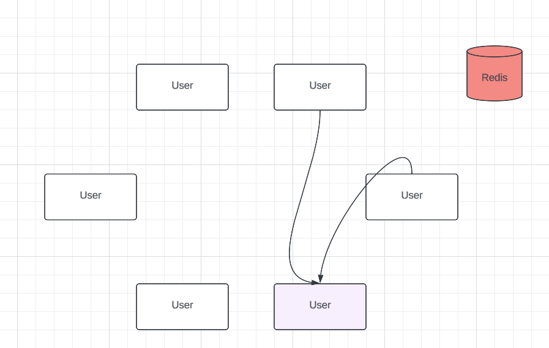
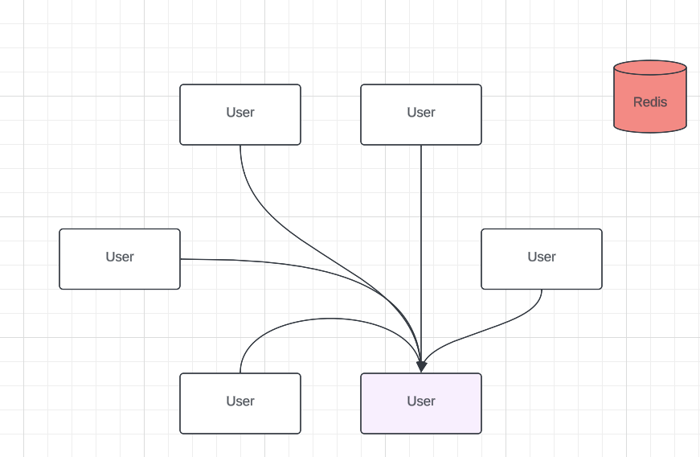
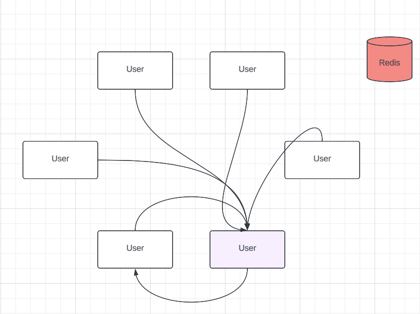

# Assignment 1 - Distributed Systems

A simple Distributed P2P video chat application.

Since we do not use NAT traversal, both endpoints must be in the same network.

Streaming port is 5555.

There is no Handshake whatsoever, anyone can connect and listen on you when streaming.

You may connecto to yourself so that you monitor your own activity.

Nodes search for other nodes based on pre-defined username. (no mutex tho)

---

A network with 6 nodes. They wish to connect to the pink node.

They query Redis to find out the local IP of the pink node (based on its username).

They connect to that IP. (Pre-defined default port)

Any node may connect to the pink node (or any other node)

The pink node decides it wants to connect to the node to its left, allowind it (the pink node) to recieve data from the other node.
